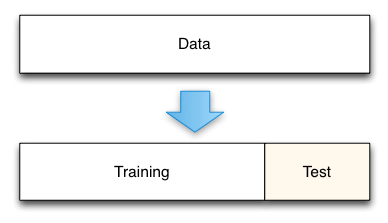

# How to divide data in 'test' and 'train' sets using 'test_train_split' function
In order to split/divide the data (in the 'bmw.csv' file), first I have checked whether it's fit for linear regression. 

Graphical representation through 'matplotlib' confirms that data is equipped for regression. 

Next, I have called the function 'test_train_split' using the 'test_size' of 0.2 which indicates 80% training data and 20% testing data. 

Then, comes the use of linear regression modle where I've first trained the model and then predicted. 

## Installation 
Use the package manager [pip](https://pip.pypa.io/en/stable/) to install Pandas, Matplotlib and Sklearn

```bash
pip install pandas
pip install sklearn
pip install matplotlib
```
 

Image source: Medium
